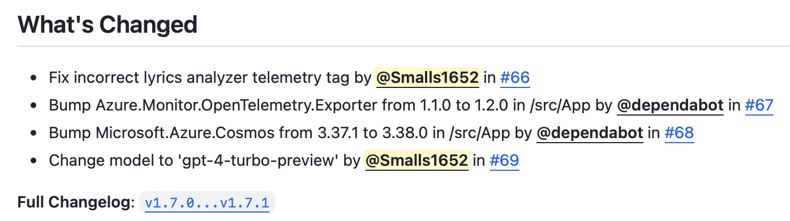
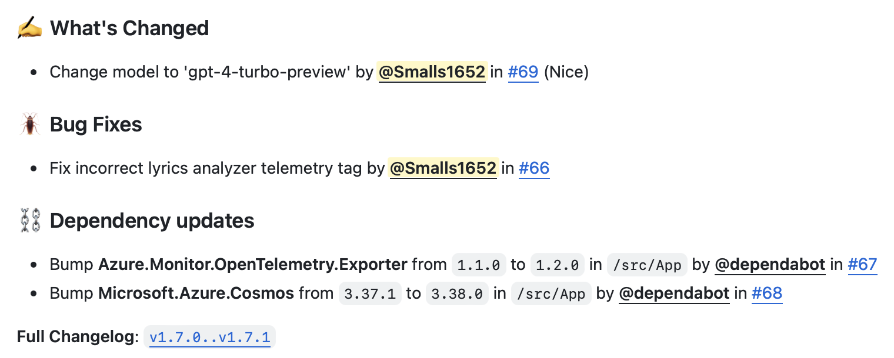

# GitHub Release Text Generator

This repo is for a CLI tool to create text for a release on GitHub.

> **_"Doesn't GitHub have that built into the release page?"_**

Yup! It's very handy, but... I found it lacking for my own use. I like to separate pull requests in the output into their own section based on what the pull request was doing.

For example, this is what the native _"generate release notes"_ tool on GitHub does:



This is a sample of what this CLI tool generates:



## 🏗️ Building from source

### 🧰 Pre-requisites

- [.NET 8 SDK](https://dotnet.microsoft.com/en-us/download/dotnet/8.0)
    - You will also need to install the pre-requisites for your platform [located here](https://learn.microsoft.com/en-us/dotnet/core/deploying/native-aot/?tabs=net7%2Cwindows#prerequisites).
        - For Linux based platforms, you primarily need to ensure that packages for `clang` and `zlib` (dev) packages are installed to your system.

### 🧱 Building

> **⚠️ Note:**
> 
> Before building, you need to know the ["runtime identifier"](https://learn.microsoft.com/en-us/dotnet/core/rid-catalog#known-rids) for your platform. For simplicity, these docs will use `linux-x64`. Replace that value with what you use, if needed.
> 
> For example if:
> * You're building on a **x64 Linux-based system**, the identifier would be `linux-x64`.
> * You're building on an **Apple-silicon macOS system**, the identifier would be `osx-arm64`.

#### Command-line

1. Set your current directory to where you cloned the repo.
2. Run the following command:

```plain
dotnet publish ./src/ConsoleApp/ --configuration "Release" --output "./build/ConsoleApp" --runtime "linux-x64" --self-contained
```

The compiled binary will be located in the `./build/ConsoleApp` directory in the local repo.

#### Visual Studio Code

1. Open the command palette (`Shift+Ctrl+P` **(Windows/Linux)** / `Shift+Cmd+P` **(macOS)**).
2. Type in **Tasks: Run Task** and press `Enter`.
   * **Ensure that is the selected option before pressing `Enter`.**
3. Select **Publish: ConsoleApp**.
4. Select your platform's runtime identifier.

The compiled binary will be located in the `./build/ConsoleApp` directory in the local repo.

## 🏃 Using the CLI tool

### 🧰 Pre-requisites for running

- [git](https://git-scm.com)
- [GitHub CLI](https://cli.github.com)
    - Ensure you're [logged into your GitHub account with the `gh` CLI tool](https://cli.github.com/manual/gh_auth_login).

### ⬇️ Installing

> ⚠️ **Note:**
> 
> These binaries are not signed. Depending on your system and security requirements, the binary may be blocked from running.

#### Manual install

1. Download the latest release for your platform on [the releases page](https://github.com/Smalls1652/GitHubReleaseGen/releases).
2. Put the binary in a directory that is in your `PATH` environment variable.

#### macOS - Homebrew

If you have [`brew`](https://brew.sh) installed, you can do the following:

```shell
brew tap smalls1652/smallsonline # Add my custom tap
brew install --cask --no-quarantine smalls1652/smallsonline/gh-releasegen # Install gh-releasegen
```

## 🗂️ Dependencies used

- [`System.CommandLine`](https://github.com/dotnet/command-line-api)

## 🤝 License

The source code for this project is licensed with the [MIT License](LICENSE).
